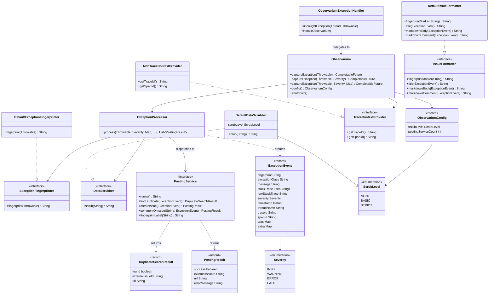

# Observarium

Observarium is an open-source exception tracking library for Java 21 that captures exceptions, deduplicates them by structural fingerprint, scrubs PII from stack traces, and posts issues directly to your issue tracker — no external server, no SaaS subscription, no agents to operate.

## Features

- **Automatic exception capture** — install a global uncaught-exception handler with one call, or capture explicitly via `captureException`
- **Deduplication via fingerprinting** — SHA-256 fingerprint over exception type + call stack + cause chain; duplicate occurrences become comments on the existing issue rather than new issues
- **PII data scrubbing** — three configurable levels strip passwords, tokens, Bearer headers, email addresses, IP addresses, and phone numbers from stack traces and messages before they leave the JVM
- **OpenTelemetry trace correlation** — reads `trace_id` and `span_id` from SLF4J MDC; zero compile-time coupling to any tracing library
- **Multiple issue tracker backends** — GitHub Issues, Jira, GitLab Issues, Email (SMTP)
- **Framework-agnostic core** — plain Java builder API works in any runtime; optional thin integration modules for Spring Boot and Quarkus
- **Bounded async queue** — a single background thread drains a configurable `ArrayBlockingQueue`; the JVM shuts it down cleanly on exit

## Architecture



## Quick Start

### Plain Java

```java
// 1. Add dependency (Gradle — replace x.y.z with the latest release)
// implementation 'io.hephaistos:observarium-core:x.y.z'
// implementation 'io.hephaistos:observarium-github:x.y.z'

import io.hephaistos.observarium.Observarium;
import io.hephaistos.observarium.handler.ObservariumExceptionHandler;
import io.hephaistos.observarium.scrub.ScrubLevel;

Observarium obs = Observarium.builder()
    .scrubLevel(ScrubLevel.STRICT)
    .addPostingService(new GitHubPostingService(GitHubConfig.of("ghp_yourtoken", "owner", "repo")))
    .build();

// Capture all uncaught exceptions automatically (reports as FATAL)
ObservariumExceptionHandler.install(obs);

// Capture explicitly
obs.captureException(exception);
obs.captureException(exception, Severity.WARNING);
obs.captureException(exception, Severity.ERROR, Map.of("user.id", "u-42"));
```

### Spring Boot

```xml
<!-- Maven — replace x.y.z with the latest release from https://github.com/hephaistos-io/observarium/releases -->
<properties>
  <observarium.version>x.y.z</observarium.version>
</properties>
<dependency>
  <groupId>io.hephaistos</groupId>
  <artifactId>observarium-spring-boot</artifactId>
  <version>${observarium.version}</version>
</dependency>
<dependency>
  <groupId>io.hephaistos</groupId>
  <artifactId>observarium-github</artifactId>
  <version>${observarium.version}</version>
</dependency>
```

```yaml
# application.yml
observarium:
  scrub-level: STRICT
  github:
    owner: owner
    repo: repo
    token: ${GITHUB_TOKEN}
```

### Quarkus

```xml
<!-- Maven — replace x.y.z with the latest release from https://github.com/hephaistos-io/observarium/releases -->
<properties>
  <observarium.version>x.y.z</observarium.version>
</properties>
<dependency>
  <groupId>io.hephaistos</groupId>
  <artifactId>observarium-quarkus</artifactId>
  <version>${observarium.version}</version>
</dependency>
<dependency>
  <groupId>io.hephaistos</groupId>
  <artifactId>observarium-github</artifactId>
  <version>${observarium.version}</version>
</dependency>
```

```properties
# application.properties
observarium.scrub-level=STRICT
observarium.github.owner=owner
observarium.github.repo=repo
observarium.github.token=${GITHUB_TOKEN}
```

## Modules

| Module | Purpose |
|---|---|
| `observarium-core` | Core engine: fingerprinting, scrubbing, async dispatch, `PostingService` SPI |
| `observarium-spring-boot` | Spring Boot auto-configuration and `@ConfigurationProperties` |
| `observarium-quarkus` | Quarkus CDI extension and config mapping |
| `observarium-github` | GitHub Issues posting service |
| `observarium-jira` | Jira Cloud / Data Center posting service |
| `observarium-gitlab` | GitLab Issues posting service |
| `observarium-email` | SMTP email posting service |

All posting modules use the JDK built-in `java.net.http.HttpClient` and Gson — no platform SDKs, no framework-level transitive dependencies. This is intentional: none of the platforms ship official Java SDKs, and the community alternatives (hub4j for GitHub, gitlab4j, everit-org for Jira) pull in heavy stacks like Jersey or Apache Commons for three API calls. See [Posting Services](docs/posting-services.md#why-not-official-sdks) for the full rationale.

## Posting Service Feature Matrix

| Service | Create issue | Deduplication | Comment on duplicate |
|---|---|---|---|
| GitHub | Yes | Yes — label-based search | Yes |
| Jira | Yes | Yes — JQL label search | Yes |
| GitLab | Yes | Yes — label-based search | Yes |
| Email | Yes | No | No |

## Documentation

Full documentation is in the [`docs/`](docs/) directory:

- [Getting Started](docs/getting-started.md)
- [Configuration Reference](docs/configuration.md)
- [Posting Services](docs/posting-services.md)
- [Custom Posting Service](docs/custom-posting-service.md)
- [OpenTelemetry Integration](docs/opentelemetry.md)

## License

MIT License. See [LICENSE](LICENSE).

## Contributing

Contributions are welcome. Open an issue to discuss significant changes before submitting a pull request. Every module has a matching test source set; run `./gradlew test` from the project root before submitting. The project requires Java 21 and Gradle (the wrapper is included).
